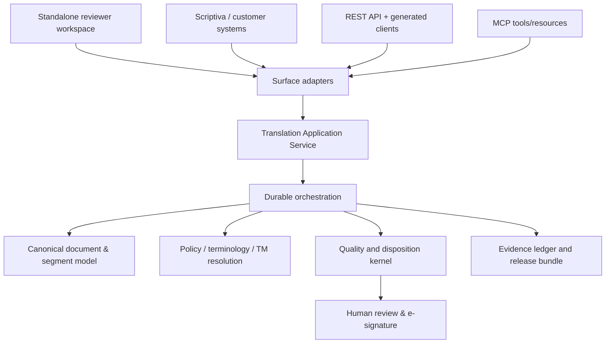

# Transmax Regulatory-Grade Translation Engine Pack

**Audience:** Transmax product, engineering, quality, security and regulatory leads  
**Prepared:** 13 July 2026  
**Decision requested:** adopt one regulated translation kernel, then expose it consistently as a hosted service, REST API, Python client and MCP capability.  
**Scope:** pharmaceutical product information first; reusable regulated-content capability second. This is an engineering and validation plan, not a claim that Transmax is already certified or accepted by a regulator.

## Executive outcome

Transmax should become a **translation assurance engine**, not an LLM wrapper. Its product is a reproducible decision: *this source unit was rendered into this target unit under this approved policy, using these locked terms, this model and these checks; it was either blocked, reviewed, or released by named authority.*

The winning product shape is one kernel and four deliberately thin surfaces:



There must be no “MCP quality” or “SDK quality” that is weaker than the hosted engine. Every surface invokes the same application service; only authentication and transport differ.

## Evidence-based starting point

### Assets to retain and consolidate

The repository already contains unusually strong raw ingredients:

- A LangGraph workflow with translation, deterministic gates, bounded refine, reverse translation and review hold.
- Versioned prompts, cost/usage capture, a defect taxonomy, language packs, strict terminology enforcement and a growing MQM evaluation path.
- A chained audit v2 writer and independent verifier, per-job configuration snapshots, tenancy machinery and a validation-pack scaffold.
- A thoughtful prior multi-surface specification and a separate SDK/MCP prototype.

### Material gaps that prevent a regulatory-grade release today

These are verified from the current worktree and must become visible programme risks rather than hidden technical debt.

| Finding | Why it matters | Required disposition |
| --- | --- | --- |
| Two execution paths exist: the database/LangGraph engine and a separate in-process SDK pipeline. | Same request can get different translation, quality, audit and tenancy behaviour depending on entry surface. | Retire the SDK’s independent pipeline as a regulated execution path; replace it with a generated remote client or an explicit non-regulated local sandbox. |
| SDK pipeline produces `[target] source` output when no model is configured; parsing errors return an empty result. | A silent substitute is unacceptable in any regulated route. | Fail closed with typed `PROVIDER_UNAVAILABLE` / `INVALID_MODEL_RESPONSE` outcomes, audit the event, and require human disposition. |
| Graph source-language detection falls back to English on low confidence/error. | A wrong source language changes the meaning of every downstream control. | Make detection a disposition: accept only above an approved threshold, otherwise `SOURCE_LANGUAGE_CONFIRMATION_REQUIRED`. |
| Audit v2 is a best-effort double-write while v1 remains active, and the graph’s string `Document` identity differs from v2’s UUID `TranslationJob` identity. | Evidence can be incomplete or cannot be unambiguously linked to the released artifact. | Choose one canonical job aggregate and make the audit ledger mandatory before release; retain v1 only for read migration. |
| Current v1 API uses in-process background tasks and joins result segments with `". "`. | Not durable across process failure; output reconstruction may corrupt structure/punctuation. | Use a durable job worker/checkpointer and canonical document reconstruction from the document IR. |
| MQM engine remains shadow-only by default; QRD checks are global and off by default. | A product cannot claim those controls govern release until approved per policy/version. | Create an explicit release-policy object with per-tenant/profile activation, validation evidence, owner and expiry. |
| Tenant middleware currently assigns a single default organisation rather than authenticated tenant claims. | This is pilot scaffolding, not tenant isolation suitable for customer data. | Derive organisation and scopes from signed identity/service-account claims; enforce database RLS in production. |
| The committed pilot readiness report says READY with one job, zero completed jobs, zero scorecards and zero audit trails. Context files also conflict on current status. | Readiness reporting is not a trustworthy release control. | Replace narrative readiness with a signed, reproducible release scorecard that fails on missing evidence. |

The repository’s own status records also show a dirty worktree and recent changes in judge-evaluation files. This pack does not alter the Transmax repository; the team should first baseline and review those local changes before implementation work begins.

## Product boundary

**Transmax owns:** translation, language/format integrity, terminology/TM enforcement, quality disposition, review workflow, evidence, release/replay and translation-specific audit.

**Scriptiva or another upstream system owns:** content authoring, source-claim authority, product/change lifecycle, market submission workflow and final label assembly. Transmax carries stable upstream references but does not recreate a label claim graph.

For an SmPC-to-market-label scenario, Scriptiva submits approved source segments and a policy profile. Transmax returns target segments, disposition, defect/review state and an evidence receipt. Scriptiva may never treat `REVIEW_REQUIRED` or `BLOCKED` as publishable text.

## The canonical regulated kernel

### 1. Immutable Job Contract

Create one `TranslationJob` aggregate. It is created from a versioned `JobSpec`, hashed and frozen before any provider call.

```yaml
job_spec:
  job_id: uuid
  tenant_id: uuid
  client_correlation_id: string
  source_authority:
    system: scriptiva
    document_ref: stable external id
    source_revision: immutable revision/hash
  content_profile:
    id: ema-smpc-label-v1
    version: 1.2.0
    risk_tier: high
  languages:
    source: en-GB
    targets: [de-DE, fr-FR]
  document_artifact:
    original_hash: sha256
    canonical_ir_hash: sha256
  constraint_snapshot:
    rule_set_ids: [uuid]
    glossary_versions: [uuid]
    tm_snapshot_id: uuid
    qrd_template_version: 10.4
  execution_policy:
    provider_route_id: approved-route-v4
    model_profile_id: translation-qualified-v3
    review_policy: dual-review-required
    budget_ceiling: {currency: EUR, amount: 250}
  idempotency_key: opaque-client-key
```

`JobSpec` is append-only. A change in source, terminology, model profile, policy, rule set, parser, prompt or market creates a new job revision; it does not overwrite prior evidence.

### 2. Canonical Document IR

Use an internal, versioned document model with XLIFF 2.1 as the interchange boundary. Each unit must retain stable identifiers and a link to the original artifact:

- `document_id`, `unit_id`, `segment_id`, order and structure path;
- source/target text plus inline placeholders and protected spans;
- table/cell/formula/figure classification;
- source checksum and canonical-IR checksum;
- source authority reference, market and content-profile context.

Plain text is a supported *input adapter*, not the internal truth. The output renderer must reconstruct from the IR; never concatenate segment strings heuristically.

### 3. Policy and knowledge resolver

Keep domain expertise data-driven. The engine should not require every customer to be an ontology expert.

| Layer | Purpose | Who supplies it | Activation control |
| --- | --- | --- | --- |
| Regulatory starter kit | QRD templates, language-specific headings, standard phrases, basic product-information checks | Transmax regulatory team | versioned and signed release |
| Industry starter kit | Pharmaceutical terminology, units, abbreviations, safety phrases and document profiles | Transmax + licensed/reference sources | provenance, licence and version recorded |
| Tenant policy pack | Approved terminology, blacklist, style, locale, market-specific exceptions | Client SMEs | maker-checker approval |
| Product/study pack | Product names, indications, dosage forms, clinical programme terms | Client SMEs / Scriptiva | linked to source revision |
| Job exceptions | Explicit approved exception with reason, owner and expiry | authorised reviewer | time-bounded and audit-visible |

Rules should be expressed as a versioned declarative policy DSL with conditions, severity, rationale, source, owner, expiry, test set and precedence. A model can propose a new rule; it can never activate it.

### 4. Resolution cascade

For every segment, record a single selected source of translation with supporting alternatives:

1. Protected spans / locked regulatory text / numeric & formula tokens.
2. Determinism library (approved canonical renderings).
3. Exact approved translation memory.
4. Approved fuzzy TM suggestion, with quality and context threshold.
5. Qualified translation provider through a pinned prompt/model profile.
6. Human authoring/revision when the system cannot safely proceed.

The cascade is not a quality score. It produces provenance. A fuzzy match is never silently substituted; it is a candidate governed by profile policy.

### 5. Orchestration and explicit lifecycle

Use a durable state machine with idempotent transitions, a persistent checkpoint and an outbox for all events. The terminal state must never be ambiguous.

```text
DRAFT → VALIDATED → NORMALISED → CONSTRAINTS_SNAPSHOTTED → TRANSLATING
→ QUALITY_EVALUATING → {BLOCKED | REVIEW_REQUIRED | APPROVAL_PENDING}
→ APPROVED → EXPORTED → EVIDENCE_SEALED → ARCHIVED
```

- A cancel, retry and provider outage has its own explicit state/event.
- The worker is restart-safe and cannot reissue provider calls without the same idempotency/provenance record.
- Auto-revision is bounded and followed by conservation checks; it can only move a unit toward review, never self-sign a high-risk release.
- `APPROVED` requires the review policy’s required human signatures, not merely an absence of detected defects.

### 6. Quality and disposition kernel

Quality needs two separate layers.

**Deterministic hard controls** block or hold where the system can prove an invariant: protected tokens, numbers, units, dosage, decimals, negation, dates, placeholders/tags, structure, forbidden terms, strict glossary, language identification, source/target coverage, prompt injection and output artifact hash.

**Evidence-generating assessment** creates structured MQM-style annotations: accuracy, terminology, fluency, style, locale and regulatory-profile checks. An independent judge may discover annotations and disagreements, but should not silently certify a release. The disposition policy consumes annotations plus hard-control results, risk tier and review policy.

Use one canonical `Finding` schema across all checks:

```yaml
finding:
  id: uuid
  segment_id: stable-id
  code: TERM.LOCKED.MISSING
  category: terminology
  severity: critical
  detector: deterministic.glossary@2.1.0
  evidence: {source_span: "...", target_span: "...", rule_id: uuid}
  remediation: review-required
  disposition: open
```

### 7. Human review and learning

The reviewer surface is part of the engine, not a UI accessory. It must show source, target, locked tokens, relevant rules, provenance, findings, changes and rationale. It supports:

- risk-based single/dual review and required role separation;
- e-signature with identity, meaning, timestamp and job/config/artifact hashes;
- immutable reviewer edit history; and
- controlled learning: edits create **proposals** for TM, glossary, rule or evaluation data. Separate authorised roles test and promote them.

### 8. Evidence, validation and release

The evidence bundle is generated from canonical records, not a narrative report:

- job/config/policy/knowledge snapshots and hashes;
- every provider call: provider, region, model, prompt hash, parameters, tokens, timestamps and request correlation;
- per-segment provenance, findings, reviewer actions and signature records;
- input/IR/output hashes; quality disposition; audit-chain verification; and
- validation release identifier, test/evaluation evidence and known limitations.

The v2 append-only ledger becomes mandatory for regulated jobs before their first customer use. Its external anchoring, retention, key custody and periodic verifier evidence must be designed as operating controls, not merely database tables.

## Surface strategy: one product, four adapters

| Surface | What it is for | Rules |
| --- | --- | --- |
| Hosted review workspace | Human review, configuration, evidence and operational exception handling | Uses the application service; it is not the authority for business rules. |
| REST API | Customer systems, Scriptiva, batch workflows and webhooks | OpenAPI 3.1 contract first; OAuth/client credentials; idempotency key on all mutations; async jobs; signed callbacks. |
| Python client | Developer ergonomics | Generated typed client over REST. Do not ship the current local execution pipeline as the regulated SDK. |
| MCP server | Agent orchestration | Thin authenticated adapter over the same application service; no direct provider access, local TM or quality calculation. |

MCP should offer long-running job operations rather than a misleading synchronous `translate(text)` promise:

```text
submit_translation_job
get_translation_job
get_job_findings
request_review
record_review_decision
lookup_approved_term
verify_evidence_chain
export_evidence_bundle
```

For small, low-risk sandbox translations, a separate `sandbox_translate` tool may exist—but it must return `non_regulated: true`, have no release path, and never share a name or response type with a regulated result.

## Scriptiva integration contract

Scriptiva should call Transmax when a source revision is ready for market-language production. The boundary is deliberately narrow:

1. Scriptiva sends immutable source unit IDs, source revision hash, market/language, content/risk profile, upstream evidence references and selected policy-pack IDs.
2. Transmax returns a job receipt with its config snapshot hash.
3. Scriptiva listens for signed lifecycle events and fetches segment results plus findings/evidence.
4. Scriptiva may assemble a label only when Transmax returns `APPROVED` and the evidence bundle verifies. It continues to own final content release in its workflow.

Required response fields include `transmax_job_id`, `source_unit_id`, `target_text`, `segment_disposition`, `translation_provenance`, `finding_summary`, `review_state`, `artifact_hash`, `evidence_bundle_uri`, `audit_chain_head` and `correlation_id`.

## Pharmaceutical starter kits

Start with a narrow, defensible kit rather than asserting universal pharmaceutical expertise:

**Release 1: EU product information**

- SmPC, labelling and package-leaflet document profiles;
- versioned EMA QRD template references and language headings;
- standard-form wording/term packs where rights and provenance permit;
- hard controls for dosage, units, strength, schedules, routes, contraindication/negation, placeholders and table structure;
- EN→DE, EN→FR and EN→ES golden corpora with expert-labelled defects;
- mandatory human review for high-risk content.

**Release 2: controlled expansion**

- additional EU languages and national profiles;
- pharmacovigilance, protocol, ICF and promotional profiles with different quality/risk rules;
- structured terminology/TBX/TMX import, reviewer skills and calibration by language/content slice.

No starter kit substitutes for client product knowledge. It gives clients a safe baseline and a structured way to co-create their pack.

## Programme workstreams and acceptance gates

| WS | Outcome | Exit gate |
| --- | --- | --- |
| 0. Baseline & safety | Resolve secrets, dirty-worktree ownership, readiness-source conflict and production configuration. | No known credential in history/current files; deployment has authenticated tenancy; scorecard cannot say READY with missing proof. |
| 1. Canonical aggregate | One job/document/segment/finding identity model and a migration plan. | A job runs and verifies entirely on one identity lineage. |
| 2. Kernel extraction | Application service and ports/adapters replace surface-specific logic. | Identical contract tests pass through UI/API/Python/MCP. |
| 3. Durable operations | Checkpoints, worker/outbox, idempotency, retries, cancellation and replay. | Kill/restart and duplicate-submit tests produce no duplicate provider action or evidence gap. |
| 4. Policy/knowledge | Policy DSL, snapshots, approvals and pharma starter kit. | A change to a policy creates a new version; expired/unauthorised rule cannot execute. |
| 5. Translation/provenance | Locked-token/cascade/model-profile controls. | Every segment has a verifiable source/provenance and unsafe no-provider path fails closed. |
| 6. Quality/disposition | Canonical findings, MQM cutover evidence, calibration and review policy. | Defect corpus meets pre-agreed recall/precision; unresolved critical finding cannot be approved. |
| 7. Format integrity | Canonical IR, parser/export adapters, artifact conservation. | Golden corpus proves placeholder/table/formula and artifact checks for supported formats. |
| 8. Evidence/CSV | Mandatory v2 audit, evidence bundle, validation pack and release gate. | Independent chain verification, traceability matrix and signed validation approval are generated per release. |
| 9. Secure service | OAuth/OIDC, service accounts, RLS, secrets, retention, observability/SLOs. | Adversarial tenant/auth tests and production configuration checks pass. |
| 10. Multi-surface launch | REST/API clients/webhooks first; MCP after parity; reviewer console throughout. | API↔MCP parity suite and signed-webhook replay tests pass. |

## Definition of done: regulated use, not feature completion

A capability is not “regulatory grade” because it has an audit table or a high test count. Before a declared regulated pilot, all must be true:

1. The production path uses the canonical kernel and canonical job identity.
2. All source, policy, prompt, model, provider and output artifacts are versioned and linkable in verified evidence.
3. No unsafe fallback can yield a releaseable output.
4. High-risk product-information profiles require configured human review and authorised sign-off.
5. A labelled, client-approved evaluation corpus proves controls for each claimed language/content profile.
6. API, UI, client and MCP parity is automatically tested.
7. Production tenancy/auth, key rotation, backups/restore, monitoring, incident handling and external audit anchoring are exercised.
8. The release bundle contains the approved intended use, URS/FS traceability, IQ/OQ/PQ evidence, residual risks and signed approvals.

## Scorecard: how to assess progress

Use the companion YAML scorecard as a release gate. A simple weighted maturity score is useful for tracking, but it must never override a red stop condition.

**Red stops:** identity split; unauthenticated production access; credential exposure; evidence-chain gap on regulated jobs; unsafe provider/language fallback; unresolved critical corpus failures; unapproved policy/model change; no required human sign-off.

Suggested programme order:

- **0–6 weeks:** WS0–3. Do not add formats, models or customer integrations until one kernel/identity/durable operation is demonstrable.
- **6–14 weeks:** WS4–8 for the narrow EU product-information starter kit and its evidence corpus.
- **14–20 weeks:** WS9–10: production hardening, REST + Python client + signed webhooks, then MCP parity.
- **After evidence is stable:** broaden industries by adding profiles/packs/evaluations, not alternate engines.

## Standards and regulatory framing

Treat standards as design inputs and customer validation expectations, not automatic certification claims. EMA’s QRD materials define templates/standard headings and are explicitly not exhaustive; the linguistic-review process remains a real human-regulatory process. That makes Transmax strongest as a verified preparation and review-assurance system, not an autonomous regulatory submitter.

- [EMA QRD human templates](https://www.ema.europa.eu/en/human-regulatory-overview/marketing-authorisation/product-information-requirements/product-information-qrd-templates-human)
- [EMA linguistic review for human product information](https://www.ema.europa.eu/en/human-regulatory-overview/marketing-authorisation/product-information-requirements/linguistic-review-human)
- [EudraLex Volume 4, including Annex 11](https://health.ec.europa.eu/medicinal-products/eudralex/eudralex-volume-4_en)
- [21 CFR Part 11 (eCFR)](https://www.ecfr.gov/current/title-21/chapter-I/subchapter-A/part-11)
- [Model Context Protocol authorization specification](https://modelcontextprotocol.io/specification/2025-06-18/basic/authorization)

## First ten implementable tickets

1. Produce an architecture decision record naming `TranslationJob` as the sole regulated job aggregate and the migration/deprecation plan for `Document`, `TranslationJobQueue` and `translation_jobs`.
2. Add a canonical `JobSpec`, `PolicySnapshot`, `DocumentIR`, `Finding` and `EvidenceReceipt` schema package with versioning tests.
3. Extract `TranslationApplicationService` and make the existing API route call it; preserve existing behaviour behind characterisation tests.
4. Convert SDK into an authenticated generated API client; move local in-process translation behind a clearly non-regulated test/sandbox package.
5. Make MCP invoke the same application service/client and replace direct `translate`, local quality and glossary tool logic with async job tools.
6. Replace background task execution with a durable worker/checkpointer and transactional outbox; add crash/replay/duplicate tests.
7. Remove language/provider/parser silent fallbacks; introduce typed hold/block codes and corresponding audit events.
8. Make audit v2 mandatory for the canonical job path, add external-anchor operations and provide a generated evidence bundle with independent verification.
9. Implement the versioned release-policy registry: policy/model/profile activation requires evidence, owner, approver and expiry.
10. Build the first 150–300 expert-labelled EU product-information corpus units and automate deterministic, MQM, reviewer and cross-surface parity regression gates.

## Decisions the leadership team must make

1. Which single canonical data model is allowed to survive the migration?
2. Is the first launch limited to managed SaaS with EU product information, or will an on-premise/data-residency offer be made? This changes operating controls, not the kernel.
3. Which content profiles/language pairs are in the first claimed intended use?
4. What review and e-signature policy applies to each risk tier?
5. Who owns and approves regulatory starter-kit revisions, model profiles and customer policy packs?
6. Which external systems are authoritative for terminology and final label release in the first Scriptiva integration?

